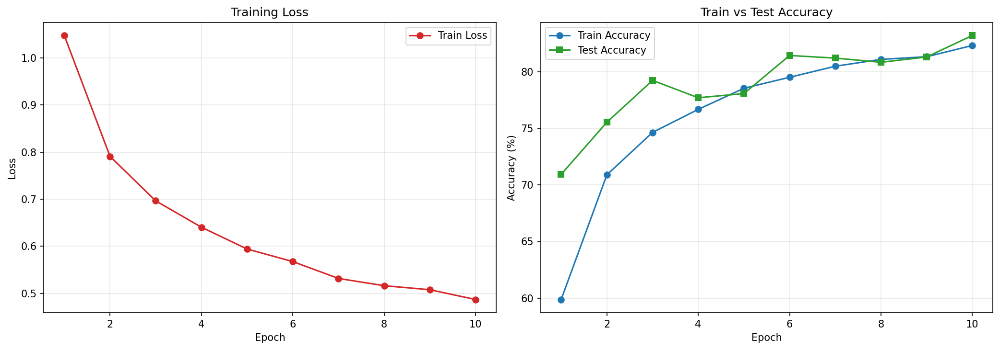
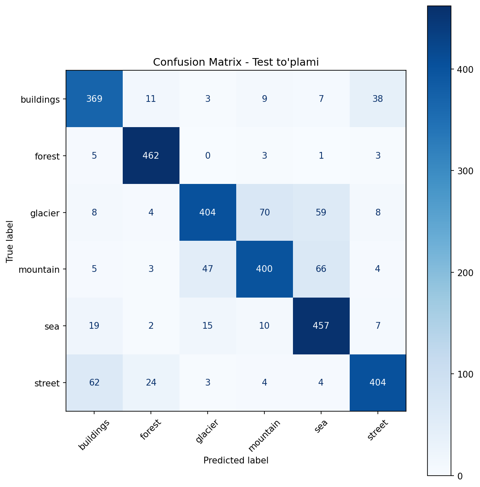

<div align="center">

# 🖼️ SimpleCNN — Sahna Tasvirlarini Tasniflash (PyTorch)

**Noldan qurilgan 2-qatlamli CNN yordamida 6 sinfli tabiiy sahna tasvirlarini tasniflash**


[](https://colab.research.google.com/github/toxirerkinov70-commits/SimpleCNN-model/blob/main/simpleCNN.ipynb)

[Demo](#-demo) · [Loyiha haqida](#-loyiha-haqida) · [Natijalar](#-natijalar) · [Model Arxitekturasi](#-model-arxitekturasi) · [Ma'lumotlar](#-malumotlar-toplami) · [Ishga tushirish](#-ishga-tushirish) · [Texnologiyalar](#-texnologiyalar)

</div>

---

## 🚀 Demo

**"Open in Colab"** tugmasi orqali — o'rnatishsiz, to'g'ridan-to'g'ri brauzerda ishga tushirish mumkin. Faqat GPU/CPU runtime tanlang, katakchalarni ketma-ket bajaring; dataset **Intel Image Classification** formatida (`seg_train/`, `seg_test/`) ta'minlansa, notebook boshidan oxirigacha avtomatik ishlaydi.

## 📌 Loyiha haqida

Bu loyihada tabiiy sahnalarni tasvir bo'yicha 6 sinfga ajratuvchi **SimpleCNN** modeli PyTorch'da noldan yaratilgan:

| Sinf | Ma'no |
|------|-------|
| `buildings` | Binolar |
| `forest` | O'rmon |
| `glacier` | Muzlik |
| `mountain` | Tog' |
| `sea` | Dengiz |
| `street` | Ko'cha |

## 📊 Natijalar

| Ko'rsatkich | Qiymat |
|-------------|--------|
| Train Accuracy (10-epoch) | **82.31%** |
| Test Accuracy | **83.20%** |
| Epochlar soni | 10 |
| Optimizer | Adam (lr=0.001) |
| Loss funksiyasi | CrossEntropyLoss |
| Batch hajmi | 32 |
| Qurilma | CPU |

> Quyidagi grafik va confusion matrix — notebookni to'liq noldan qayta ishga tushirib olingan **haqiqiy** natijalar. Tasodifiy vaznlar ishga tushirilishi va augmentatsiyadagi tasodifiylik sababli aniqlik dastlabki yozuvdagi (Train 83.04% / Test 84.40%) qiymatlardan bir necha o'ndan foizga farq qiladi — bu normal holat.

### Training Curve

Har bir epochdan keyin train/test aniqligi va train loss kuzatilgan (real, notebook ijrosidan olingan):



### Confusion Matrix

Test to'plami (3000 tasvir) bo'yicha 6 sinfli confusion matrix — qaysi sinflar bir-biri bilan ko'proq aralashishini ko'rsatadi:



Eng ko'p uchragan chalkashliklar (diagonaldan tashqari yuqori qiymatlar): `mountain` → `sea` (66 ta), `glacier` → `mountain` (70 ta), `mountain` → `glacier` (47 ta) va `street` → `buildings` (62 ta) — bular vizual jihatdan bir-biriga yaqin sahnalar bo'lgani uchun kutilgan natija. `forest` sinfi esa eng yaxshi ajratilgan (474 tadan 462 tasi to'g'ri, ~97.5%).

## 🧠 Model Arxitekturasi

```
SimpleCNN(
  (conv1): Conv2d(3, 16, kernel_size=3, padding=1)
  (pool):  MaxPool2d(2, 2)
  (conv2): Conv2d(16, 32, kernel_size=3, padding=1)
  (pool):  MaxPool2d(2, 2)
  (fc1):   Linear(32768, 128)
  (fc2):   Linear(128, 6)
)
```

Kirish: `128×128` piksellik RGB tasvirlar → 2× (Conv + ReLU + MaxPool) → Flatten → FC(128) → FC(6) → Chiqish: 6 sinfdan biri

## 🗂️ Ma'lumotlar To'plami

**Intel Image Classification** dataset:
- Train: **14,034** tasvir
- Test: **3,000** tasvir
- Papka tuzilishi: `Amaliy/seg_train/` va `Amaliy/seg_test/` (har biri 6 sinf papkasidan iborat)

### Data Augmentation (faqat Train uchun)

```python
transforms.RandomHorizontalFlip()
transforms.RandomRotation(15)
transforms.ColorJitter(brightness=0.3, contrast=0.3, saturation=0.2)
transforms.RandomResizedCrop(128, scale=(0.8, 1.0))
transforms.Normalize([0.485, 0.456, 0.406], [0.229, 0.224, 0.225])
```

## 🚀 Ishga tushirish

### 1) Colab'da (dataset kerak, tavsiya etiladi tezkor sinov uchun)

Yuqoridagi **Open in Colab** tugmasini bosing.

### 2) Lokal muhitda

```bash
git clone https://github.com/toxirerkinov70-commits/SimpleCNN-model.git
cd SimpleCNN-model
pip install torch torchvision matplotlib scikit-learn
```

Dataset papkasini loyiha ichiga joylashtiring:

```
SimpleCNN-model/
├── Amaliy/
│   ├── seg_train/
│   │   ├── buildings/
│   │   ├── forest/
│   │   └── ...
│   └── seg_test/
│       ├── buildings/
│       ├── forest/
│       └── ...
└── simpleCNN.ipynb
```

So'ng Jupyter Notebook'ni oching va barcha katakchalarni ketma-ket ishga tushiring.

## 🛠️ Texnologiyalar

`Python` · `PyTorch` · `torchvision` · `matplotlib` · `scikit-learn` (confusion matrix) · `Jupyter Notebook`

## ✍️ Muallif

Amaliy mashg'ulot №2 — Machine Learning kursi
